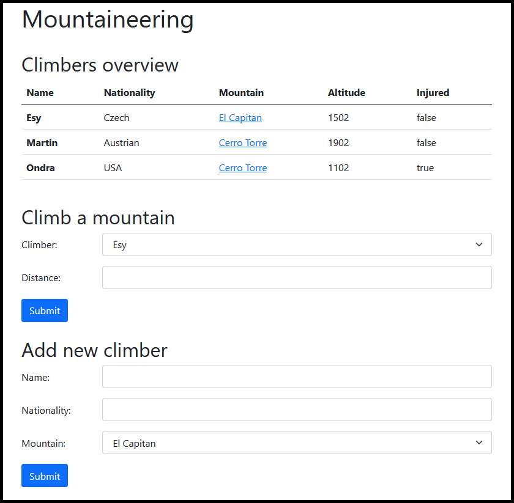
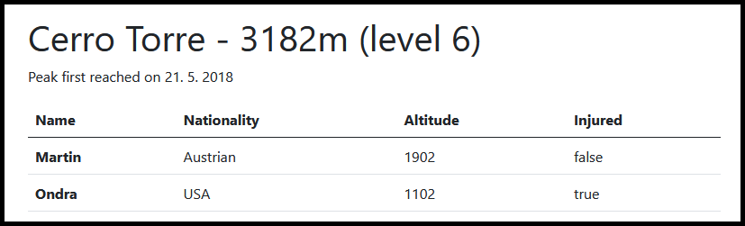

## Getting Started

- **Fork** this repository under your own account
- Clone the forked repository under your account to your computer
- Create a `.gitignore` file so generated files won't be committed
- Commit your progress frequently and with descriptive commit messages
- All your answers and solutions should go into this repository

## Keep in mind

- You can use any resource online, but **please work individually**
- **Don't just copy-paste** your answers and solutions, use your own words
  instead
- **Don't push your work** to GitHub until your mentor announces that the time
  is up
- Before diving into coding **think about the structure**

# Mountaineering

Our goal is to build an application that will help us keep track of mountain **climbers** trying to ascend **mountains**.

## Domain description

We work with two different entities in this application:

- Every climber has a name, nationality and:
	- Climber should store his/her current altitude of ongoing ascend
	- Climber should have status signifying whether he/she is injured or not (true or false)
- Climber can be only on one mountain at a time, but multiple climbers can be
  present on one mountain

- Mountain has a name, height and difficulty level (integer)
  - Each mountain also has a record about the date when first climber reached its top (can be empty, meaning noone has reached its top yet)

## Frontend 

- This application has two different frontend views:
  - One displaying overview of all mountains, and two forms, one allowing us
  to record new climb progress and other one allowing us to create a new climber
  - Other one, displaying detail of a mountain and climbers currently present on it
- You do not have to concern yourself with fancy styling. **Focus on
  functionality!**
  
## Database

It is up to you to define what the database model will look
like, it just needs to help the backend fulfill the outlined functionality.

Only requirements are:

* all climbers and mountains need to be stored in the database
* climbers and mountains will be stored in separate tables
* there must be some relationship between these tables

## Endpoints

* Your endpoints shouldn't be returning 500 status codes that would be a
result of **unvalidated user inputs**.

### GET `/`



This page displays frontend's mainpage which has:

- a heading with the title of the site
- table of climbers as depicted above, showing us their name,
mountain they are currently climbing, their altitude on this mountain and their injury status (true or false)
  - name of the mountain should be a link which leads to mountain's detail
  (described in GET `/mountains/{id}` endpoint right below)

- Main page contains two forms:

#### Climb a mountain

- display all **non injured** climbers in select
- allow user to input distance the climber is going to ascend

#### Create a climber

- input for all necessary information about climber: name and nationality
- display all mountains in select to choose which mountain he/she will begin climbing

### GET `/mountains/{id}`



This page shows detail of mountain with given `id`:

- name of the mountain, its height and its difficulty level (0-999m level 1, 1000-1999m level 2, ...)
- if any climber previously reached its top, we also show date of when this happened
  - don't show anything in case mountain hasn't been climbed yet

- we also show simple table with all climbers **on the selected mountain**
  - this is similar table to that on mainpage

### POST `/climbers`

- This endpoint is responsible for the creation of a new climber based on data from Add new climber form
- Newly created climber should have a mountain assigned based on selection in form
- Newly created climber is not injured by default, and is located at 0 altitude of his/her selected mountain
- Redirect user back to mainpage afterwards

### POST `/climbers/climb/`

- This endpoint accepts data from Climb a mountain form
- This endpoint is responsible for tracking climber's progress on the mountain he/she is currently on
- Climber can climb just in case he/she is not injured. If this is the case, endpoint just redirects user back to the mainpage.
- Passed distance will be added to the climber's altitude
  - if climber reaches the top, check whether he/she is the first one to make it and store current date (on the mountain) if that is the case
  - this altitude cannot be set higher than mountain's height (our climbers are basically stuck on the top :))
- Redirect user back to mainpage afterwards

### POST `/climbers/{id}/rescue/`

- This endpoint will send a rescue helicopter towards the climber with given `id`
- It can be used only on injured climber. If given climber isn't injured return 400 status code
- Injured climber will be rescued from the mountain
  - this means that his progress is reset to 0 (0 altitude) and he/she is healed (no longer injured)
- Return 200 status code on success

### GET `api/climbers?nationality=US&above=1500`

- this endpoint should return information about climbers of given nationality above certain altitude
  - when checking for nationality, our comparison should be case **insensitive** and partial (searching for `US` gives us both `aUStria`n and `USa` based climbers as seen below)
- returned climbers should be **sorted by their current altitude**
- this is what output should look like (follow this format):

```json
[
  {
    "name": "David Lama",
    "nationality": "Austria",
    "altitude": 2750,
    "injured": true,
    "mountain": "Cerro Torre"
  },
  {
    "name": "Jim Bridwell",
    "nationality": "USA",
    "altitude": 1921,
    "injured": false,
    "mountain": "Cerro Torre"
  }
]
```

# SQL Question

Given the following table named `applicants`.

| id | name               | country_id | age | preference |
|:---|:-------------------|:-----------|:----|:-----------|
| 1  | Bořivoj Souček     | 1          | 24  | Java       |
| 2  | Papp Patrícia      | 2          | 33  | JavaScript |
| 3  | Kocsis Ivett       | 2          | 37  | Python     |
| 4  | Slavomír Vykukal   | 1          | 20  | Java       |
| 5  | Bruno Malík        | 1          | 31  | Java       |
| 6  | Veronika Lukešová  | 1          | 18  | JavaScript |
| 7  | Székely Miklós     | 2          | 29  | Python     |
| 8  | Hegedüs Benjámin   | 2          | 37  | Python     |
| 9  | Nela Machová       | 1          | 20  | Python     |
| 10 | Balog Rajmund      | 2          | 39  | Java       |

Given the following table named `countries`.

| id | country        |
|:---|:---------------|
| 1  | Czech Republic |
| 2  | Hungary        |

Write queries that:

1. Select name and preferences of applicants under age of 30 from Hungary (using name of the country within query, and not the `country_id` value)
2. Since we won't be offering Python courses in Hungary anymore, update preference of all hungarian applicants to `Unknown` (you can use explicit `country_id` value here)
3. Show average age of Czech and Hungarian applicants such as: 


| country        | average_age |
|:---------------|:------------|
| Czech Republic | 22.6000     |
| Hungary        | 35.0000     |


You can use this SQL to replicate tables and their data in your database:

```sql
SET FOREIGN_KEY_CHECKS = 0;

DROP TABLE IF EXISTS `devices`;

CREATE TABLE applicants (
    `id` int auto_increment NOT NULL,
    `name` varchar(255),
    `country_id` int,
    `age` int,
    `preference` varchar(255),
	PRIMARY KEY (`id`)
);

BEGIN;
INSERT INTO `applicants` VALUES (1, 'Bořivoj Souček', 1, 24, 'Java');
INSERT INTO `applicants` VALUES (2, 'Papp Patrícia', 2, 33, 'JavaScript');
INSERT INTO `applicants` VALUES (3, 'Kocsis Ivett', 2, 37, 'Python');
INSERT INTO `applicants` VALUES (4, 'Slavomír Vykukal', 1, 20, 'Java');
INSERT INTO `applicants` VALUES (5, 'Bruno Malík', 1, 31, 'Java');
INSERT INTO `applicants` VALUES (6, 'Veronika Lukešová', 1, 18, 'JavaScript');
INSERT INTO `applicants` VALUES (7, 'Székely Miklós', 2, 29, 'Python');
INSERT INTO `applicants` VALUES (8, 'Hegedüs Benjámin', 2, 37, 'Python');
INSERT INTO `applicants` VALUES (9, 'Nela Machová', 1, 20, 'Python');
INSERT INTO `applicants` VALUES (10, 'Balog Rajmund', 2, 39, 'Java');
COMMIT;


CREATE TABLE countries (
    `id` int auto_increment NOT NULL,
    `country` varchar(255),
	PRIMARY KEY (`id`)
);

BEGIN;
INSERT INTO `countries` VALUES (1, 'Czech Republic');
INSERT INTO `countries` VALUES (2, 'Hungary');
COMMIT;

SET FOREIGN_KEY_CHECKS = 1;
```
